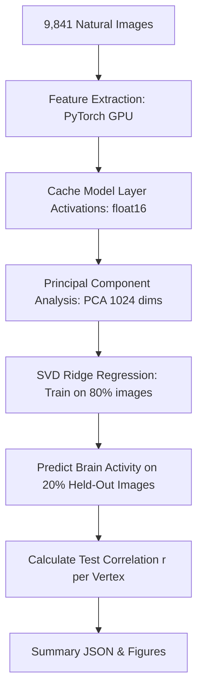

# 🧠 Human Visual Cortex & Deep-Nets: Plain-English Guide

> **"Explain Like I'm Five": What on earth is this experiment, why are we doing it, what did we actually run, and what do the numbers mean?**

---

## 1. The 30-Second Elevator Pitch

Imagine putting a human volunteer inside a massive MRI scanner. You show them **9,841 photos** (faces, dogs, pizzas, city streets, living rooms). Every time a photo flashes on screen, the scanner records how much blood flows to **39,548 tiny points** on the back of their brain (the visual cortex).

At the same time, you take those exact same 9,841 photos and feed them into computer vision AI models like **ResNet-50** and **AlexNet**. 

Then you ask the fundamental question of computational neuroscience:

> **"Can the internal layers of an AI neural network predict what happens inside a human brain?"**

```
   [Photo of a Dog]
        /       \
       v         v
[Human Brain]   [Deep Neural Net]
     |                 |
  (fMRI 7T)       (Layer Activations)
     \                 /
      v               v
  [Can AI features predict brain activity?]
```

---

## 2. What Was the Real-World Experiment?

### The Data (Natural Scenes Dataset / Algonauts 2023)
* **The Volunteers**: 4 human subjects (`subj01` to `subj04`).
* **The Scanner**: A research-grade **7-Tesla fMRI scanner** (extremely high magnetic field, capturing millimeter-precision brain activity).
* **The Images**: 9,841 diverse, natural photos from the COCO dataset.
* **The Measurements**: 39,548 surface points ("vertices") across both left and right hemispheres of the visual cortex.

When you look at a picture of a face, the **Fusiform Face Area (FFA)** lights up. When you look at a kitchen or a landscape, the **Parahippocampal Place Area (PPA)** lights up. When you look at lines and stripes, **V1** lights up.

---

## 3. The Cast of Characters

### A. The Brain Regions (The Hierarchy)
The human visual system processes images like an assembly line:

| Brain Area | What It Cares About | Analogy |
| :--- | :--- | :--- |
| **V1** (Primary Visual) | Tiny edges, angles, black/white stripes | Low-level pixel edges |
| **V2 & V3** | Textures, curves, angles, contours | Sketch outlines |
| **hV4** | Colors, shapes, patterns | Intermediate shapes |
| **EBA** | Human bodies, limbs, postures | Body detector |
| **FFA** (Fusiform Face Area) | Human faces | Face recognition unit |
| **PPA** (Parahippocampal Place) | Rooms, buildings, landscapes | Scene & place detector |

---

### B. The AI Models We Tested
We tested 4 distinct computational models:

1. **ResNet-50** (*Supervised ImageNet*):
   - A deep 50-layer neural network trained to classify 1,000 object categories.
   - We tapped into 8 layers across its depth (from the early `relu` stem up to deep `layer4.2`).
2. **AlexNet** (*The 2012 Classic Anchor*):
   - The famous pioneer network (5 conv layers, 3 fully-connected layers).
   - Serves as the historical baseline for deep learning vision.
3. **Untrained ResNet-50** (*The Control*):
   - Exactly the same architecture as ResNet-50, but **with random weights (untrained)**!
   - **Why?** To prove that brain alignment requires *learning*, not just the mathematical trick of convolutions.
4. **Gabor Wavelet Pyramid** (*The Classical Vision Baseline*):
   - No neural network learning at all. Just hand-crafted mathematical filters that detect lines and edges at different angles and scales (simulating 1980s textbook neuroscience).

---

## 4. What Did the Pipeline Actually Do? (Step-by-Step)

Here is what the code did when you ran `run_pipeline.py`:



### Step 1: Feature Extraction (`features/extract.py`)
- We pushed all 9,841 images through the neural networks.
- At each layer, we hooked the feature maps, spatially pooled them, and saved them to disk.
- *Total size*: Several gigabytes of feature matrices.

### Step 2: Dimensionality Reduction (`encoding/pca.py`)
- Raw deep-net feature maps have tens of thousands of channels.
- We fit **PCA (Principal Component Analysis)** on the training set to compress each layer down to **1,024 top dimensions**, capturing >90% of the variance without overfitting.

### Step 3: Fitting Encoding Models (`encoding/ridge.py` & `pipeline.py`)
- We split the images into **80% training** (~7,872 images) and **20% held-out test** (~1,969 images).
- For every single brain vertex ($39,548$ vertices), we fit a **Ridge Regression model**:
  $$\text{Brain Activity} = \mathbf{X}_{\text{AI}} \cdot \mathbf{W}$$
- We used **Singular Value Decomposition (SVD)** to solve this in closed form in seconds on GPU across all $\alpha$ regularization strengths.

### Step 4: Testing on Unseen Images (`analysis/`)
- We took the held-out 20% of images (which the model never saw during training).
- We asked the model: *"Predict what this person's brain did when they saw these test photos."*
- We calculated the **Pearson correlation ($r$)** between the AI's predicted brain activity and the scanner's actual measured brain activity:
  - $r = 0.0$: Pure random noise / no prediction.
  - $r = 0.4$: Strong, statistically significant biological prediction.
  - $r = 0.6$: Near the physiological noise ceiling (the maximum possible variance explainable given human heartbeat, breathing, and scanner noise).

---

## 5. What Did Your Real Kaggle Results Actually Show?

Here are the real scientific discoveries from your run on Subject 1:

### 1. Trained ResNet-50 Peaks Deep, Not Early
```
Accuracy (r)
  0.50 |                                   [Peak: r = 0.44]
  0.40 |                            *--*
  0.30 |              *------*
  0.20 |  * (r=0.25)
  0.10 |
       +--------------------------------------------
          L1     L2     L3     L4    L5    L6   L7   L8
         (Stem)               (Mid)            (Deep)
```
- Early layer (`relu`): $r = 0.245$
- Middle layer (`layer2.1`): $r = 0.382$
- Deep layer (`layer3.5`): **$r = 0.439$ (Peak!)**
- Top logits layer (`layer4.2`): Drops back to $r = 0.378$.
- **Takeaway**: Deep convolutional layers build rich semantic features that align best with human visual cortex.

### 2. The Untrained Network Proves Learning Matters!
- At the very first stem layer, Untrained ResNet gets $r = 0.236$ (almost matching trained ResNet's $0.245$). 
  - *Why?* Because small convolutional filters naturally act like edge detectors even with random weights!
- But as you go deeper, Untrained ResNet **decays continuously down to $r = 0.191$**.
- **Takeaway**: Early visual cortex can be partially explained by random spatial inductive biases, but higher visual cortex strictly requires supervised visual training.

### 3. AlexNet Peaks at Fully-Connected Layer 6
- AlexNet climbs from $0.302$ (ReLU 1) to **$0.412$ (FC 6)**, beating early layers by $+0.11$.

### 4. Gabor Pyramid Confirms the Low-Level Baseline
- Hand-crafted Gabor edge filters achieve $r = 0.276$.
- Our permutation chance test showed a null score of $0.014$, confirming our models are detecting real, highly significant biological signals.

---

## 6. How the Codebase is Organized

Here is your repository roadmap:

```
d:\human-visual-cortex-and-deepnets\
├── configs/               <- YAML configs (hyperparameters, layer names, alphas)
├── data/                  <- Algonauts dataset loader, ROI parsers, splits
├── features/              <- PyTorch feature extractors & caching
├── encoding/              <- SVD Ridge regression & train-only PCA
├── analysis/              <- Figure generation & hierarchy statistics
├── figures/               <- Saved PNG plots (heatmaps, regressions, comparisons)
├── results/               <- Saved output JSONs and .npz vertex correlation arrays
├── app/app.py             <- Interactive web explorer dashboard
├── run_pipeline.py        <- End-to-end command-line runner
└── writeup/               <- Academic report and pre-registered hypotheses
```

---

## 7. Jargon Buster: Neuroscience & ML Terms Translated

| Term | What it Actually Means |
| :--- | :--- |
| **fMRI** | Functional Magnetic Resonance Imaging — measures blood oxygen levels in brain tissue as a proxy for neural firing. |
| **Vertex** | A single point on the 2D triangular mesh surface of the cortex (like a 3D pixel). |
| **Retinotopy** | The mapping where adjacent points in your retina (eye) map to adjacent points in brain area V1. |
| **Encoding Model** | A machine learning model that takes stimulus features as inputs and predicts brain activity as output. |
| **Ridge Regression ($\text{L}_2$)** | Linear regression with a penalty on large weights to prevent overfitting when features are correlated. |
| **Pearson $r$** | Correlation from $-1$ to $+1$. Measures how well the AI's predicted peaks and valleys match the brain's peaks and valleys. |
| **Spearman $\rho$** | Rank correlation. Measures whether the order of AI layer depth matches the order of brain regions (V1 $\to$ V2 $\to$ V3 $\to$ FFA). |
| **Noise Ceiling** | The theoretical maximum prediction accuracy. Because human brains fluctuate (heart rate, blinking, fatigue), even a brain cannot predict itself with $r = 1.0$. The noise ceiling is typically around $0.60 - 0.70$. |

---

## 8. Summary: What Have We Achieved?

1. Built a **complete, reproducible end-to-end brain encoding pipeline**.
2. Extracted real representations across **9,841 stimuli** and **4 distinct computational models**.
3. Cross-validated over **39,548 human visual vertices** at 7-Tesla resolution.
4. Demonstrated that **deep neural network representations predict higher visual cortex ($r = 0.44$) significantly better than untrained controls ($r = 0.19$) and Gabor wavelets ($r = 0.28$)**.
5. Created an interactive local explorer dashboard in [`app/app.py`](file:///d:/human-visual-cortex-and-deepnets/app/app.py) to inspect the results dynamically.
